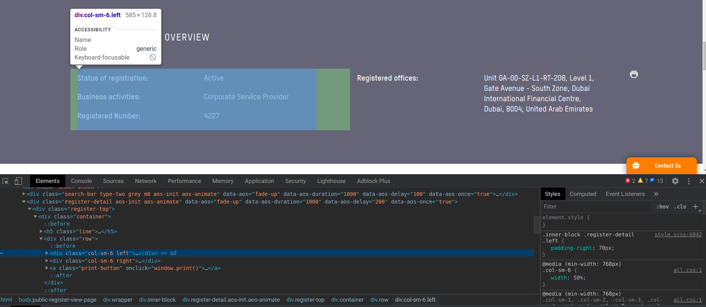
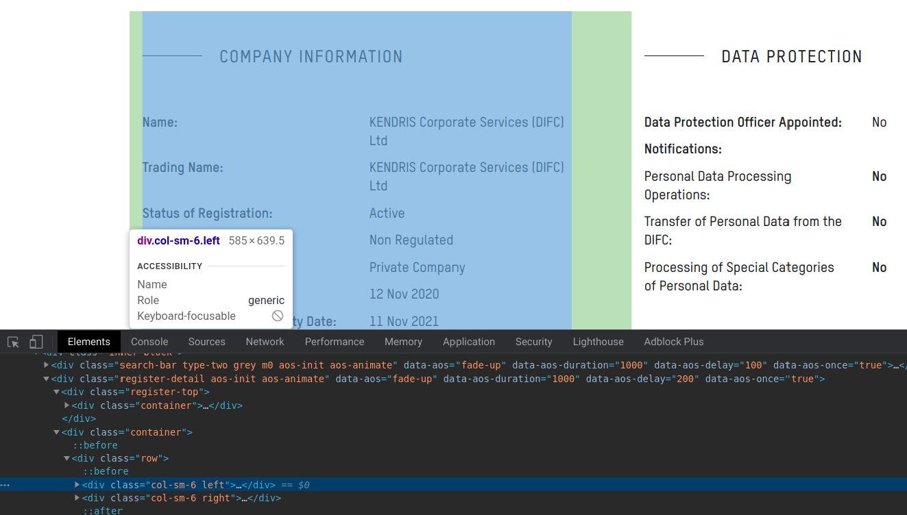
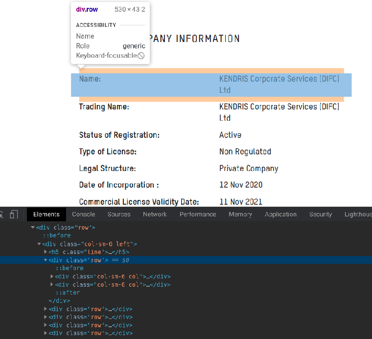

# Парсер для  _[difc.ae](https://www.difc.ae/public-register/)_

Программа собирает все данные о компаниях и сохраняет их в базу данных `MongoDB`


## Как работает парсер

При анализе сайта выяснилось, что существует страница, на которой находятся ссылки на все компании: https://www.difc.ae/public_register_1.xml

Для того чтобы получить ссылки из xml используется `SitemapSpider` и правила:
```python
sitemap_urls = ['https://www.difc.ae/public_register_1.xml']
sitemap_rules = [
        ('/public-register/', 'parse_company')
    ]
```

Далее, при анализе, выесняется Xpath путь до `div` контейнера в котором хранится нужная
информация о компании.
 



Далее замечаем, что относительно самих контейнеров с информацией,
XPath до ключа и значения одинаков у всех извлекаемых контейнеров:



Путь до ключа или занчения относительно контейнера, который их содержит
тоже везде одинаков:
```
Ключ: ./div[1]//p//text()
Значение: ./div[2]//p//text()
```

Таким образом мы можем гибко извлекать все данные компаний не пропустив
ни одного значения. А в случае если меняется XPath у сайта, то поменять 
его в `config.py`

## Как установить

Установите Python пакеты из `requirements.txt`:

```bash
pip install -r requirements.txt
```

Заполните переменные в файле `config.py` своими данными для работы.

Запустите скрипт для сбора информации компаний из [Dubai International Financial Centre public registry](https://www.difc.ae/public-register/):
```bash
python start.py
```

### Рекомендации
 В документации _Scrapy_ настоятельно рекомендуется устанавливать его в специальной _виртуальной среде_ 
 во избежание конфликтов с пакетами вашей системы.
 ```bash
python3.8  -m venv scrapy_env
source scrapy_env/bin/activate
```
После активации виртуальной среды можете приступать к установке проекту как было описанно раннее.